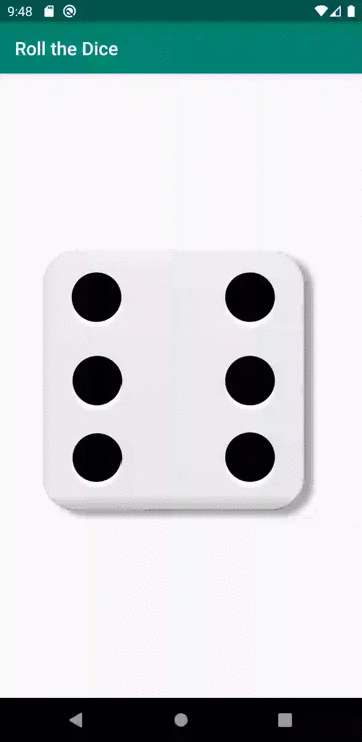

# Roll the Dice

This is an Android programming exercise. The target is to create an app which rolls the dice whenever the smartphone gets shaken.

## Steps to Target

1. Roll the dice on each app start
2. Roll the dice on each button click
3. Roll the dice with animation on each button click
4. Roll the dice with animation on each shake gesture detection

## Preview

This is how the functionality of step3 could look like:

